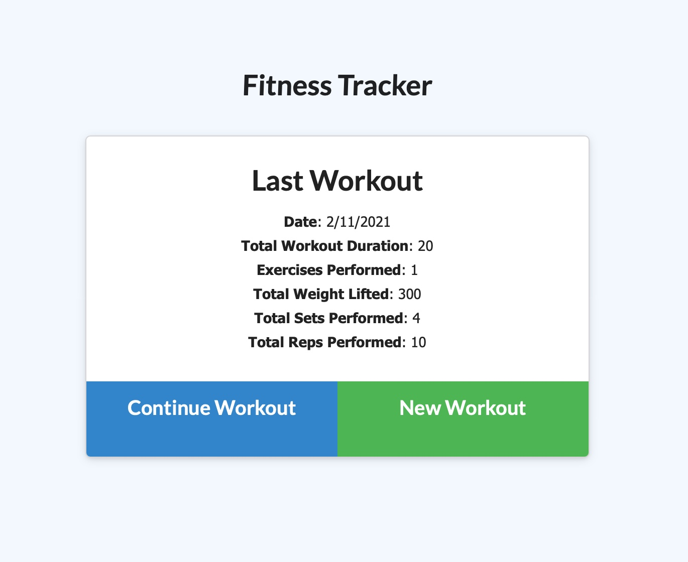

# SMU-Homework-15-Workout-Tracker

## Description

For this assignment, we were provided with the front end code we had to create a Mongo database with a Mongoose schema and use Express to handle routing.

## Installation

Clone the repo, install dependencies, and run.

## Usage

Here is a screenshot of the app in action:

